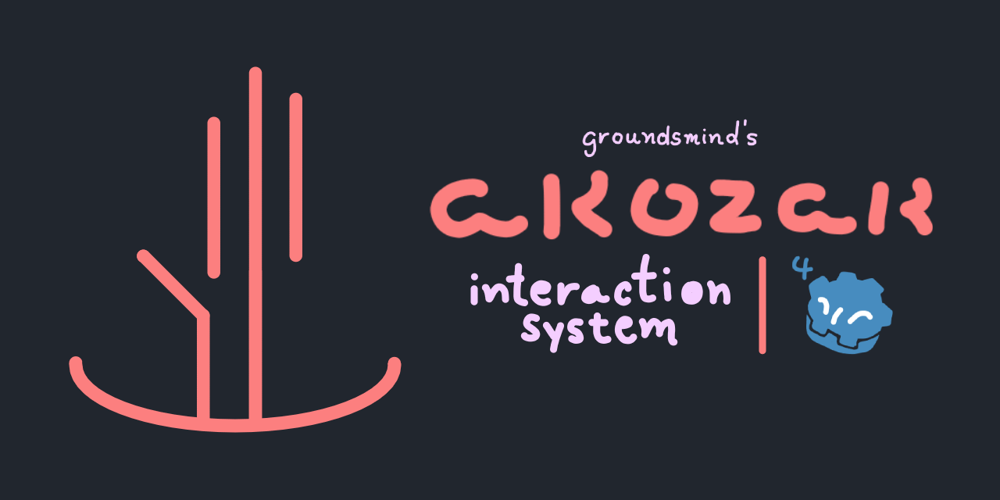

[](https://godotengine.org/)
# Akozak Interaction System
a pretty handy and simple interaction system for all your 3d needs :)
made in around a day!

# 1. Installation
### 1.1 Manual
* Download this repo's source code
* Copy the `addons` folder to the root of your project
* Inside the editor, go to `Project -> Project Settings -> Plugins` and enable Akozak Interaction System
### 1.2 Asset Store
soon...


# 2. Usage
this usage example will go over some basic implementation for a first-person player.


## 2.1 Player
* Add the `ReachArea3D` node as a child of the player's camera. (drag-and-drop from `addons/akozak-interaction/nodes/Interactions/ReachArea3d.tscn`)

---

## 2.2 Interactable Object
### 2.2.1 Setup
A standard interactable object is set up like so:
```
Node3D
├── MeshInstance3D
└── InteractArea3D
    ├── CollisionShape3D
    └── Marker3D
```
* The `InteractArea3D`'s CollisionShape3D will determine the area in which you have to hover for the action to register.
* The Marker3D child is only used when utilizing akozak's default UI. it also works without it, but your mileage may vary; it sets the hint to a position slightly above the CollisionShape3D.

To add actions, select the `InteractArea3D` and add entries to the Interactions array on the inspector.

### 2.2.2 Connection
Connecting the actions is usually made through a script in the root Node3D. 
* Select the `InteractArea3D`, navigate to the Signals tab and connect the corresponding signals to the script.
* `action_start()` is generally used for press actions, while `action_finished()` is for hold actions.
* Each `InteractAction` has a `hint: String` property, which you can use to differentiate actions in code:
```
func _on_interact_area_action_cancel(action: InteractAction) -> void:
	match action.hint:
		"Action One":
			function_1()
		"Action Two":
			function_2()
		"Action Three":
			function_3()
```

### 2.2.3 Useful methods
By referencing the `InteractArea3D` in your script, you can call `disable_action()` and `enable_action()` (which take in a hint string as argument) to change an action's state.

---

## 2.3 Prebuilt UI


You may make use of akozak's prebuilt UI by simply instantiating the InteractionHints3D node, preferably on the scene's root.
There are also some settings to mess around with, mainly the progressbar's background and line color.
