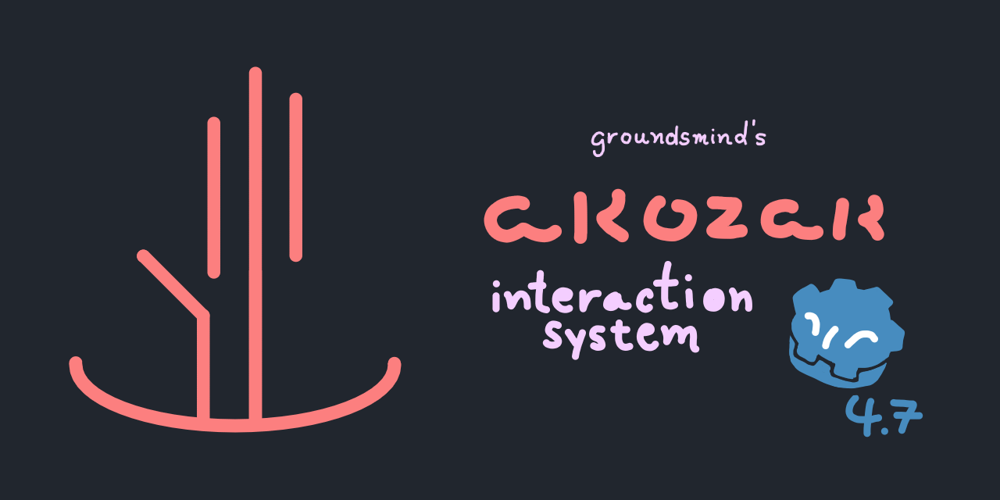
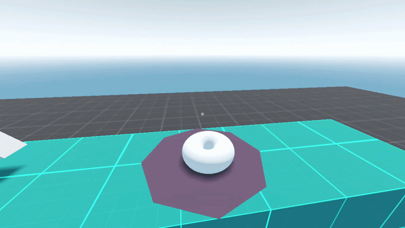

# Akozak Interaction System
a pretty handy and simple interaction system for all your 3d needs :)
made in around a day!

# Installation
### Manual
* Download this repo's source code
* Copy the `addons` folder to the root of your project
### Asset Store
> [!NOTE]
> pending approval! will have a link here soon

# Documentation
Refer to the [wiki](https://github.com/groundsmind/akozak/wiki)
