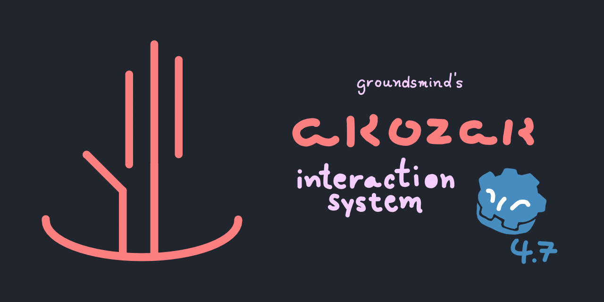
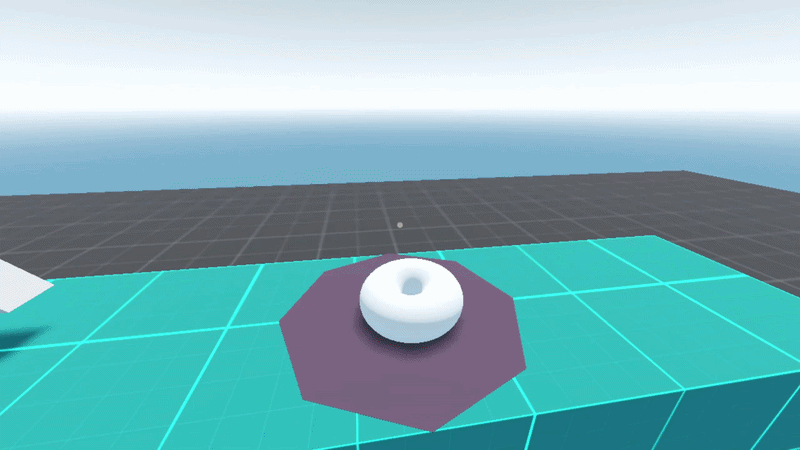

# Akozak Interaction System
a pretty handy and simple interaction system for all your 2D/3D needs :)

# Installation
### Asset Store
download through the [asset library on your browser](https://godotengine.org/asset-library/asset/5498) or search "akozak" inside godot's asset library!
### Manual
* Download this repo's source code
* Copy the `addons` folder to the root of your project

# Documentation
Refer to the [wiki](https://github.com/groundsmind/akozak/wiki)

# Contact
If you encounter any issues (or just want to share your project using akozak!), feel free to contact me through [discord](https://discord.com/users/542160345456967720).
